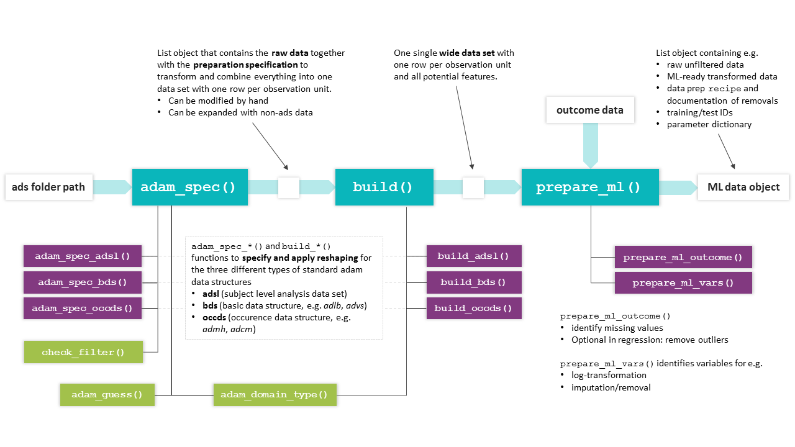

```{r setup, include = FALSE}
library(martini)
library(tidyverse)

knitr::opts_chunk$set(
  collapse = TRUE,
  comment = "#>",
  eval    = FALSE
)
```


## Scope

**Package**

The `MARTINIprep` package is the first part of the BMDI MARTINI pipeline, which aims at assessing the relation of baseline information from clinical domains with a given outcome. 
`MARTINIprep` provides a convenient framework to gather information from different clinical data sets and to combine them into a machine-learning ready data set.
The output is meant to be used with packages 
<!-- TODO adjust package names-->
`MARTINImodtune` and `MARTINIreport`,
both included in the `MARTINI` meta package.

The automated part of the preparation workflow is handled by the three main functions of `MARTINIprep`, namely
`adam_spec()`, `ads_build()`, and `prepare_ml()`.

<!-- add links  -->
<!-- * \link{\code{ads_spec}}\code{()} -->
<!-- * \link{\code{ads_build}}\code{()} -->
<!-- * \link{\code{prepare_ml}}\code{()} -->

<!-- * `adam_spec()` -->
<!-- * `ads_build()` -->
<!-- * `prepare_ml()` -->

The package was developed in the clinical context which is reflected in the default settings and specifics of both the main and helper functions. This vignette is solely focused on the standard clinical setting. 
However, the functions may also be used with more general data sets, please refer to the individual help pages for full details.

**Vignette**

This vignette serves as a hands-on tutorial on the usage of the `MARTINIprep` package. 
It clearly outlines the steps on how to get from an ads folder to a machine-learning data set, listing a number of commonly required adaptations along the way. 
<!-- gives valuable advice -->

The package comes with a number of example data sets from raw sas data sets to read in, 
to data objects representing intermediate steps (`martini_spec`, `martini_build`) 
as well as the final output object (`martini_ml`) for further use in the 
<!-- TODO additional data package to include multiple endpoints? Cover only classification here-->
<!-- TODO adjust package names-->
`MARTINImodtune` and/or `MARTINIreport` modules of the pipeline.

<!-- The full process is described in a lot more detail in the "under the hood" vignette of the package, where    -->


## High-level concept

In the (admittedly unrealistic) case that no manual adaptations have to be made to the data contained in the ADaM data sets included in the analysis, the full preparation could be accomplished by running the composed command

```{r, eval = FALSE}
path %>% 
  adam_spec() %>% 
  build() %>% 
  prepare_ml()
```

where `path` would be defined as the location where the ADaM data sets are stored in `.sas7bdat` format. 
The chart below highlights the main workflow and related helper functions.


```{r, out.width='100%', eval = TRUE, echo = FALSE, fig.cap = 'Overview of `MARTINIprep` functions. The basic workflow from ads path to ML data object is accomplished by the main functions (turquoise), which make use of the (mostly internal) helper functions shown below. '}


```

<!-- {width=100%} -->
<!--  -->


## Example study MARTINI 

This package comes with an example study containing three data sets in `.sas7bdat` format, covering the three different ADaM data types:

* adsl (adsl, wide format)
* advs (bds, long format)
* admh (occds, long format)

These data sets will be used to illustrate how to make manual adaptations in order to customize the preparation process to a particular analysis and research task.  


We will focus on the description of the main functions, but each package function (exported or not) has its own help page, so feel free to learn more about the detailed functionality on the individual pages. 
<!-- TODO or the 'MARTINI in depth' vignette -->

### Getting started

**File location**

In the setting of clinical studies, we assume that a set of analysis data sets (ads) is stored in `.sas7bdat` format in a single folder `path`. 

After specifying the folder location

```{r path, eval = TRUE}
# path <- 'path/to/sasfiles'
path <- system.file(
  "martini_example_study", "ads", 
  package = "martini", mustWork = TRUE
)
```

you may check beforehand which data sets can be processed automatically to make sure, all information of interest can be incorporated in the analysis. 
Running `adam_domain_type(path)` returns a tibble with the name of the domain, its mapped ADaM data type(occds/adsl/bds) along with the full file path. 
For domains with `type=='none'` no mapping information is available (yet) and the data set would not be processed automatically.

In case a particular domain is required for your analysis but not included in the current list, please get in touch with the package maintainers 
(<a href="mailto:sebastian.voss.ext@bayer.com">Sebastian Voss</a>, 
<a href="mailto:maike.ahrens.ext@bayer.com">Maike Ahrens</a>).
<!-- TODO add details on:
... or use the appropriate internal functions `ads_spec_*` and `build_*` to process the data set. -->

```{r domain type, eval = TRUE}
adam_domain_type(path)
```

**Outcome preparation**

It is recommended to clearly define the outcome of interest and prepare the _outcome_ data set before getting into the feature engineering process. 
The outcome data set may contain information on different endpoints in a single tibble, with one row per `id` and the different outcomes in the columns. For time-to-event data, each endpoint is described by two columns (representing time and censor, resp.). 

Since the analysis of survival endpoints is computationally much more expensive than for classification, the latter may be used for initial runs by using a dichotomized version of the endpoint (i.e. event yes/no in given time frame). When binarizing time-to-event endpoints, please pay attention to the study duration (potentially reduce to subjects with minimum time under observation) and the resulting outcome distribution (highly unbalanced data?).

<!-- TODO actually prepare outcome(s) 
update once outcome dataset is ready -->


<!-- TODO: Use the function `binarize_tte()` in order to derive binary endpoints from a tte outcome. -->


### `ads_spec()`

The `adam_spec()` function creates a _preprocessing specification_ in the form of a list from a given `path`.
Each entry contains the required information to extract relevant records from a particular data set and reshape the data into wide format. 
The structure of these entries depends on the type of corresponding data set (adsl/bds/occds).

Among other steps, `adam_spec()` will

* generate md5 checksums 
* identify data sets that can be processed automatically (by matching file names against an internal library). 
* create a parameter dictionary 

In general, this automatically created specification may be used with the subsequent workflow, however, in practice, it will be modified by the user to match specific requirements.


```{r adam_spec, eval = TRUE}
ads_spec <- adam_spec(path)

ads_spec %>%  
   str(max.level = 1)
```

#### Important parameters

**Filters**

The `filter` argument takes a character vector of valid filter expressions. A filter will be applied to a particular data only if its application yields a non-empty tibble (i.e. no error thrown, at least one row is selected). Common filters may be based on visit or treatment information, as well as flags indicating analysis sets.

The `pre_study` argument allows to conveniently reduce e.g. medical history records to data that is available at baseline based on the study day.

```{r}
filters  <- c(
  "AVISIT == 'Baseline'",
  "ITTFL == 'Y'",
  "!is.na(TRT01A)",
  # exclude a single parameter 
  "PARAMCD != 'BPDIA'"
)

ads_spec <- adam_spec(
  path, 
  filter    = filters, 
  pre_study = TRUE
)
```


**Domain selection**

Use `keep/drop` arguments to select/deselect particular data sets in the folder `path` for your analysis. 
Only selected files will be read in order to create a specification, so these parameters directly impact run time.


**Attach data**

In order to create a data set specification, the data set has to be read first which may take a considerable amount of time for large files. For a more time-efficient usage, the data sets may be stored directly in the `ads_spec` object from where the actual execution of the preparation will be conducted. 

In the current implementation, if changes to any of the data sets shall be made (see  below), all data sets have to be attached. 


```{r}
ads_spec <- adam_spec(
  path, 
  attach_data = TRUE
)
```


#### Manual adaptations

The most common adaptations of an automatically generated _spec_ object are the removal of particular variables and adjustment of factor level order and/or names.

**Exclude data**

We already covered how to discard a _complete domain_ by using the `drop` argument in `adam_spec()`.

A single parameter from a (_non-subject level_) domain can be discarded by using the `filter` argument in `adam_spec()`.

In the following, we demonstrate how to remove variables from adsl (_subject level_):

The columns to be selected from the `adsl` data set are stored in `ads_spec$adsl$select`. 
Simply remove column names from this entry to discard particular variables. 
Reasons for exclusion may include but are not limited to:

* post baseline information (MARTINI pipeline aims at assessing the relation of baseline information with a given outcome. Consequently, outcome-related information should be removed (e.g. death flag))
* variables are available in both a continuous as well as categorical version (e.g. age, BMI, weight)
* different groupings based on the same variable (e.g. country group)


```{r spec remove adsl columns}
ads_spec$adsl$select <- ads_spec$adsl$select %>% 
  
  # remove post baseline information
  setdiff(c('DEATHFL')) %>% 
 
  # categoricals with a continuous version 
  str_subset("AGEGR|BMIGR|WEIGGR|RACEGR", negate = TRUE) %>% 

  # several grouped versions available
  str_subset("CNTYGR[3-7]") 

```


**Change existing data** 

If any manual changes need to be made to the data sets themselves, the `attach_data` parameter of `ads_spec()` needs to be set to `TRUE`. 
In this case, top level entry of `spec` will have a `data` slot where the data set is stored and used by the `build()` function.
Just like the other slots, it may be adjusted by the user in an intermediate step as shown in the following.


```{r spec change data}
# identify variables that contain explicit "unknowns"
var_unknown <- ads_spec$adsl$data %>% 
  select_if(is.character) %>% 
  select_if(~{any(str_to_lower(.x) %in% c("u", "unknown"))}) %>% 
  colnames()

var_unknown

# recode "unknowns" as NA
ads_spec$adsl$data <- ads_spec$adsl$data %>% 
  mutate_at(var_unknown, ~if_else(str_to_lower(.x) %in% c("u", "unknown"), NA_character_, .x))

```

**Add data**

<!-- Adding data on a subject level is a special case of _changing data_: overwrite the data slot of the subject level spec (again, make sure to set `attach_data = TRUE`) by the extended data set. -->
<!-- Make sure to also adjust the dictionary by adding the variable description(s) and other relevant information. -->

```{r}
ads_spec$adsl$data <- left_join(
  ads_spec$adsl$data,
  additional_data
)
```


<!-- TODO: write example for new entry added data -->

In order to add new (external) data, simply add a new entry in the existing `ads_spec` object.
Depending on the type of the data you are adding, create a list that has the same structure as the relevant exemplary one above. 

<!-- Assuming you want to add subject level data, the  -->

```{r, include = FALSE}
ads_spec$add$data <- list(
  file = file_to_add,
  md5  = md5(file),
  data = additional_data,
  type = 'adsl',
  filter = 
  select =   
)
```


**Factor level order**

In order to change factor level names and/or their order, update the `factor_levels` entry of the corresponding data set in the _spec_ object. The information is stored in a list, where the entries are named after the column containing the factor levels (i.e. TRT01A instead of TRT01AN).
This is often used to specify the order of the treatment variable to control the order in the result presentation.

<!-- TODO CHECK in the original data set (i.e. before renaming?) -->

```{r spec change factor levels/order}
# change order of treatment levels
ads_spec$adsl$factor_levels$TRT01A <- ads_spec$adsl$factor_levels$TRT01A %>% na.exclude %>% rev()
```

 


**Change data set label**

```{r spec change label}
# change label column in admh
ads_spec$admh$label <- "MHBODSYS"
```


### build()

Based on a given `ads_spec` object (modified or generated fully automatically), the `ads_build()` function will _execute_ the extraction of the relevant information according to the ads_spec entries and combine everything into a wide data set with one row per _id_. This data set is the basis for the feature matrix used later on for machine learning.

```{r}
feature <- build(spec)
```


<!-- #### Relevant helper functions -->

<!-- Internally, `build()` will call the appropriate `build_*()` function for each data type (adsl/bds/occds).  -->

<!-- While `spec_bds()` and `spec_occds()` are rather similar in the sense that only few columns need to be extracted and reshaped, a lot more steps are required for the preparation of adsl. -->

<!-- <!-- link to build_ads() etc --> 


<!-- **build()** -->

<!-- * extract factor codings and rename levels to obtain valid feature names -->
<!-- * removal of -->
<!--   * datetime columns (for certain analyses) -->
<!--   * redundant columns (id, treatment, combined columns) -->


<!-- **build_bds()/build_occds()** -->


### prepare_ml()

Once all potential features are available in a single data set, the `prepare_ml()` function will take care of the data preprocessing required for machine learning analysis based on the provided outcome data (see above for recommended preparation)

```{r}
ml_data <- prepare_ml(
  feature, 
  outcome
)
```

While each step is optional and parametrized to provide maximum flexibility to the user, default parameters were chosen carefully and may be considered appropriate for a large number of analyses.

The preprocessing includes the following steps

* splitting in training and test set (stratified by e.g. treatment)
* removal of noise 
* reduction of multicollinearity by removing highly correlated variables
* log-transformation of highly skewed variables
* normalization
* imputation
* dummy coding


<!-- TODO add value list for prepare_ml() -->

<!-- #### Relevant helper functions -->

<!-- **prepare_feat** -->

<!-- * rename -->
<!-- * reshape -->


<!-- **prepare_outcome** -->

<!-- * remove ids with missing outcome values  -->
<!-- * identify and remove outliers for regression outcomes (optional) -->


